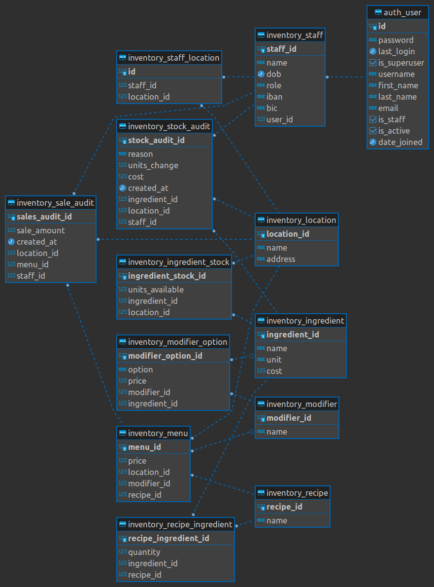

# Inventory management app

## About

I have chosen Django to develop this app. Normally, I would have chosen a much faster and lightweight
framework to develop an API such as Flask, or FastAPI. And then develop a separated React frontend to consume the API.
But given the short time allowed and realizing that no front-end work would be possible, I decided to use Django so 
that at least the models and their data could be visualized on a browser in the Django admin backoffice.
Another advantage is to use Django's default ORM to comfortably interact with data.

Regarding the database to store our data, I have chosen PostgresDB because the nature of the app's data
suits very well to a relational database (i.e. staff works in a location, ingredients are used in recipes and recipes are available in a menu item and a menu item available in a location, etc).
For development, I have configured a Postgres instance running in another container.
However, for production, a fully managed relational database service -- like AWS RDS or Google Cloud SQL -- would be better than managing our own Postgres instance within a container.


**For this MVP I have prioritized:**

- Develop all features requested. 
- Have a good data model (See below the [ER Diagram](#er-diagram)).
- Have a dockerized app possible to run in any machine.
- Import the data dump provided.

**Time constraints have made to de-prioritize the followings aspects for this MVP: (aka things missing or improvable)**

- Missing a proper front end. However, a work-around is provided with the Admin backoffice.
- Unit testing. Normally I love to be as close as possible to TDD, but to produce something meaningful I had to save time on this :(
- Security: de-prioritized on MVP given that _"The app will not be public facing, it should not be shared across locations. Each site has secure Wi-Fi and staff will access the store’s system using a mobile web browser via a local IP address."_
- Proper logging and exceptions handling.
- Some code in the views file could be more DRY but no time to refactor that
- Endpoints should not get staff id in the body but the user should be logged in and sending the bearer authentication token on auth headers
- The reports endpoints should be a GET and not a POST with the manager logged in and sending auth headers. Also, the other endpoints should follow more the RESTful standards (lack of time for thoughful design but can exlain more during the walk through)
- Missing online api documentation tool (i.e. Swagger or ReDoc)
- Missing production dockerfile and production docker compose using gunicorn and nginx. Remove .env file for production and use something like AWS Secrets Manager.

## How to run on development containers

This can be run in any Unix, Windows, or MacOS machine. 
The only requirement is to have [Docker](https://docs.docker.com/engine/install/) installed.

```
git clone git@github.com:fdiazcaballero/inventory-management.git
cd inventory-management
cp .env.dev-sample .env.dev
docker compose up --build

# or to run containers in background:
# docker compose up -d --build
```

Note that in the entry point of the Dockerfile I'm running already 
the migrations and running a Django command that I created to import to the db 
the "Weird Salads - Data Export" file that was provided. So after running the above
the app should be in the desired initial state.
See file [app/inventory/management/commands/import.py](app/inventory/management/commands/import.py)

Flake8 and the unit tests are run as part of the build pipeline in the Dockerfile (and also in the pre-commit hook).


Try [http://localhost:8000/ping](http://localhost:8000/ping)

You can run the following command to create an admin superuser:
```commandline
docker compose exec web python manage.py createsuperuser 
```

Then you can log in the admin space in [http://127.0.0.1:8000/admin](http://127.0.0.1:8000/admin)
There you will be able to inspect the models. For example for Locations: [http://127.0.0.1:8000/admin/inventory/location/](http://127.0.0.1:8000/admin/inventory/location/)

## Happy flow to verify that the app works

After you have successfully built the application with the commands above.
You can now run the bellow command to test that the main requirements for the app work.

**1. Accept deliveries:**

Note: we'll add enough of needed ingredients to be able to sell menu item 1 later on.
```commandline
curl --location --request POST 'http://localhost:8000/inventory/ingredient-stock/accept-delivery/' \
--header 'Content-Type: application/json' \
--data-raw '{
    "staff_id": 65,
    "location_id": 21,
    "delivery": [
        {
            "ingredient_id": 403,
            "units": 50            
        },
        {
            "ingredient_id": 409,
            "units": 50
        },
        {
            "ingredient_id": 92,
            "units": 50
        },
        {
            "ingredient_id": 440,
            "units": 50
        },
        {
            "ingredient_id": 19,
            "units": 50
        },
        {
            "ingredient_id": 205,
            "units": 50
        }
    ]
}'
```
You can use the admin [http://127.0.0.1:8000/admin/inventory/ingredientstock/](http://127.0.0.1:8000/admin/inventory/ingredientstock/)
to verify that the ingredients are now in stock.

**2. Take stock**

Let's throw away some waste that came with the previous delivery 
(don't worry we'll have enough left to sell our menu 1)
```commandline
curl --location --request POST 'http://localhost:8000/inventory/ingredient-stock/take-stock/' \
--header 'Content-Type: application/json' \
--data-raw '{
    "staff_id": 10,
    "location_id": 21,
    "take_stock": [
        {
            "ingredient_id": 403,
            "units": 1            
        },
        {
            "ingredient_id": 409,
            "units": 1
        }
    ]
}'
```
Verify at [http://127.0.0.1:8000/admin/inventory/ingredientstock/](http://127.0.0.1:8000/admin/inventory/ingredientstock/)
that some quantities have decreased accordingly.

**3. Sell items**

Now let's sell a menu item

```commandline
curl --location --request POST 'http://localhost:8000/inventory/menu/2/sell/' \
--header 'Content-Type: application/json' \
--data-raw '{
    "staff_id": 10,
    "location_id": 21
}'
```

Verify at [http://127.0.0.1:8000/admin/inventory/ingredientstock/](http://127.0.0.1:8000/admin/inventory/ingredientstock/)
that the menu's recipe quantities have been taken off the stock.

**4. Pull reports**

After the previous actions now we have some data for our reports:

- **Inventory report**: Get all the inventory movements in a period for a given location.
```commandline
curl --location --request POST 'http://localhost:8000/inventory/inventory-report/' \
--header 'Content-Type: application/json' \
--data-raw '{
    "staff_id": 225,
    "location_id": 21,
    "start_date": "01/01/2023",
    "end_date": "28/02/2023"
}'
```
You should get the csv report data in command line when running the curl command, or you can save into a csv file if you're using Postman
But you can also check the model in the admin [http://127.0.0.1:8000/admin/inventory/stockaudit/](http://127.0.0.1:8000/admin/inventory/stockaudit/)

If you have run exactly the first 3 commands above. This inventory report csv should
be exactly like the one below (obviously with different timestamps and if you have passed the correct dates range in the request)

```csv
stock_audit_id,reason,cost,ingredient_id,staff_id,created_at
1,delivery,13.0,403,65,2023-02-17 19:19:01.668534+00:00
2,delivery,71.0,409,65,2023-02-17 19:19:01.674037+00:00
3,delivery,130.5,92,65,2023-02-17 19:19:01.678927+00:00
4,delivery,89.0,440,65,2023-02-17 19:19:01.683536+00:00
5,delivery,146.5,19,65,2023-02-17 19:19:01.687816+00:00
6,delivery,52.5,205,65,2023-02-17 19:19:01.692323+00:00
7,waste,0.26,403,10,2023-02-17 19:19:09.432211+00:00
8,waste,1.42,409,10,2023-02-17 19:19:09.435642+00:00
9,sale,1.352,403,10,2023-02-17 19:19:15.417439+00:00
10,sale,5.821999999999999,409,10,2023-02-17 19:19:15.425500+00:00
11,sale,6.786,92,10,2023-02-17 19:19:15.432600+00:00
12,sale,2.492,440,10,2023-02-17 19:19:15.439707+00:00
13,sale,17.287000000000003,19,10,2023-02-17 19:19:15.446933+00:00
14,sale,3.8850000000000002,205,10,2023-02-17 19:19:15.453123+00:00
```

- **Financial report**: containing for the selected period
  - total cost of all deliveries
  - total revenue from all sales
  - total value of current inventory (at the request time)
  - cost of all recorded waste

```commandline
curl --location --request POST 'http://localhost:8000/inventory/finantial-summary/' \
--header 'Content-Type: application/json' \
--data-raw '{
    "staff_id": 225,
    "location_id": 21,
    "start_date": "01/01/2023",
    "end_date": "28/02/2023"
}'
```
Again you should get the csv in the command line when running the curl command. 
These are figures computed on real time so there is no equivalent model for them.
However, an interesting model to check is the Sales Audit [http://127.0.0.1:8000/admin/inventory/salesaudit/](http://127.0.0.1:8000/admin/inventory/salesaudit/)

If you have run exactly the first 3 commands above. This inventory report csv should
be exactly like the one below (obviously with different timestamps and if you have passed the correct dates range in the request)
```csv
location_id,period,total revenue from sales (in period),total deliveries cost (in period),total waste cost (in period),current inventory value (17-02-2023)
21,01/01/2023 to 28/02/2023,9.09,502.5,1.68,463.196
```

This is a happy flow but there are endless combinations where the staff doesn't have the allowed role
or doesn't work in the location, the ingredient stock is low to sell a menu, etc, etc that will produce errors as expected. 
Please feel free to play with it and maybe break it! :)

## ER Diagram

Entity-relationship model diagram of our data:


